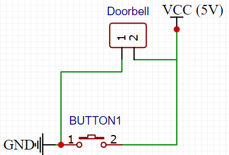
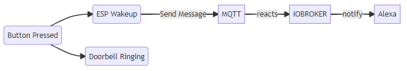

[](https://github.com/SBajonczak/IOT-Doorbell-Notification/actions/workflows/platformio-ci.yaml)

## :ledger: Index
**Table of Contents**
- [:beginner: About](#beginner-about)
- [:electric_plug:  Hardwaresetup](#electric_plug--hardwaresetup)
  - [Components List](#components-list)
- [:notebook:Pre-Requisites](#notebookpre-requisites)
- [:cactus: Branches](#cactus-branches)
- [MQTT](#mqtt)
- [:nut_and_bolt: Development Environment](#nut_and_bolt-development-environment)
  - [:hammer: Build the Firmware](#hammer-build-the-firmware)
  - [Compilerflags](#compilerflags)
  - [:rocket: Upload the firmware](#rocket-upload-the-firmware)
  - [:page_facing_up: Upload the configuration](#page_facing_up-upload-the-configuration)
- [Configuration](#configuration)
  - [Upload Predefined Configuration](#upload-predefined-configuration)
- [Planned Features](#planned-features)

# :beginner: About
In my homeoffice I wear always my headphones. 
So I sometimes didn't realize that my doorbell rings. 

So I decided, to connect an ESP Device to my doorbell. This will trigger the esp up from it's sleep and send me a small message to my Teams or alexa or s.th. 

My standard doorbell wiring is like this schematic design. 



My Problem is that I never thrust any IT design, so I need a safe backup.
The Bell must be ringing, whatever happens. So the new architecture must follow this flow:



1. Pushing the Button
2. The Bell is ringing
3. The Esp will wake up from it's deep sleep state
4. The ESP will send a message to the MQTT Server
5. IOBroker will react on the message and send a notification to e.g. Alexa

You will se, that the ESP Device will __attached__ to the doorbell as a secondary device.  


# :electric_plug:  Hardwaresetup 

So I must separate the two circuit from each other. Because when the bell starts to ring, and the ESP will get the full power of the current transformer...it will be fried by the higher voltage.

So I must separate the tow circuit. I decided to use a optocoupler to to this. 

An (simple description) optocoupler contains internally a LED and a sensor. When the LED turns on, the sensor will recognize it. When the sensor indicate a light, it will close the second circuit, like a switch. When the LED turns of, it will interrupt the circuit.

The Internal LED of the optocoupler has a maximum volatage of 1.2 V. So I must attach a resitor befor the optocopler, to reduce the input voltage. 

## Components List
I Ordered the following parts from my local seller

* Wemos D1 Mini or an  ESP01s
* Resistor, 330Ω
* Diode, 1N4148
* Optocoupler, PC817

## Wemos D1 mini


## ESP01 S


# :notebook:Pre-Requisites

* bblanchon/ArduinoJson@^6.18.3
* knolleary/PubSubClient@^2.8

# :cactus: Branches
Here some description about the used branches

|Branch|Description|
|-|-|
|master|This contains the latest stable version|
|development|In this branch, I will put every development work for now. This branch is __NOT__ stable|


# MQTT

The Data will be transfered to the configured MQTT Server.
The default topic name will be build on the configured _basetopic_, concatenated with the unique deviced id. 

Then followed by the active or the voltage value.

In my setup it will shown up like this: 


|Topicname|Description|
|{_BseTopic_}/{_UniqueDeviceID_}/active|This will be set everytime to one when the device wake up.|
|{_BseTopic_}/{_UniqueDeviceID_}/voltage|This value will hold the last measured voltage.|

# :nut_and_bolt: Development Environment
First of all, the following commands required an installation of Platform IO. You can install it with the following command: 

```bash
setup-virtualenv
```

## :hammer: Build the Firmware
You can Build your firmware very easy with the following command:

```bash
make build-complete
```
## Compilerflags
For the behaviour of the device, I inserted some compilerflags. 
These flags can be set into the platformio.ini at the device block under the `build_flags` option.

```ini

[env:espdev/complete]
platform = espressif8266
board = d1_mini
framework = arduino
build_flags =     
                -D WIFI_CONNECT_TRY_COUNTER=10
```

The following table wil give you an introduction about the available flags and their purpose: 

|Name|Description|
|-|-|
|WIFI_CONNECT_TRY_COUNTER|This will set the retry count when trying to connect to the WIFI|

## :rocket: Upload the firmware
After a successful build you can upload it to your connected device with: 

```bash
make upload-firmware
```
In some cases you have multiple device connected. In this case, you must set the port to upload before with this command:

```bash
export PLATFORMIO_UPLOAD_PORT=/dev/ttyUSB0
```

This upload the firmware througth the /dev/ttyUSB0 port.

## :page_facing_up: Upload the configuration
```bash
export PLATFORMIO_UPLOAD_PORT=/dev/ttyUSB0
make upload-config
```

# Configuration 
The Configuration is done with an json file. An example of it looks like this:

```json
{
   
    "wifi": {
        "ssid": "WifiName",
        "password": "Password"
    },
    "mqtt": {
        "basetopic": "MyBaseTopic",
        "server": "My Server IP",
        "port": 1235,
        "user": "Username",
        "password": "Password"
    }

}


{
    "sleep": {
        "timeinMinutes": 0
    },
    "battery": {
        "muliplicator": 0.0148230088
    },
    "wifi": {
        "ssid": "WifiName",
        "password": "Password",
        "staticIp":"your static ip adress",
        "gateway":"your default gateway",
        "subnet":"your subnet"
    },
    "mqtt": {
        "clientname": "Your clientname that will be visible",
        "basetopic": "MyBaseTopic",
        "server": "My Server IP",
        "port": 1235,
        "username": "Username",
        "password": "Password" 
}
```
The following table will give you more insights about the settings.

|Group|Setting|Description|
|-|-|-|
|wifi|ssid|The wifi SSID.|
|wifi|password|The password to authenticate.|
|wifi|gateway|Thedefault gateway for your network.|
|wifi|staticIp|Give them a static ip to minimize the conntion time.|
|wifi|subnet|The subnet for your network.|
|battery|multiplicator|This is the multiplicator setting to gain the battery measurement.|
|mqtt|server|The host for the mqtt. This can be a dns name or a ip address.|
|mqtt|port|The Mqtt Port.|
|mqtt|username|The username when authentication is configured.|
|mqtt|password|The password when authentication is configured.|
|mqtt|basetopic|This will set the basetopic that will be used to send the message (described above)|
|mqtt|clientname|With this name, the device will popup in your network.|

## Upload Predefined Configuration
After you modified the configuration to your setting, you can upload this to your device.
```bash
 make upload-config
```

# Planned Features
Nothing planed at the moment

Maybe a camery integration or so :)