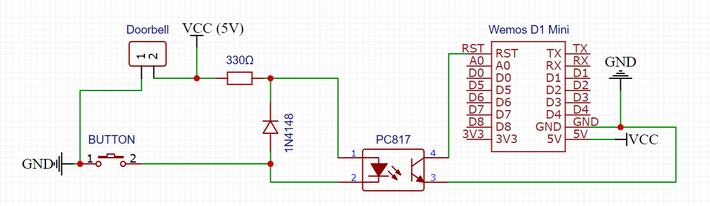

## :ledger: Index
**Table of Contents**

- [:beginner: About](#beginner-about)
- [:electric_plug:  Hardwaresetup](#electric_plug--hardwaresetup)
  - [Components List](#components-list)
- [:notebook:Pre-Requisites](#notebookpre-requisites)
- [:cactus: Branches](#cactus-branches)
- [:nut_and_bolt: Development Environment](#nut_and_bolt-development-environment)
  - [:hammer: Build the Firmware](#hammer-build-the-firmware)
  - [:rocket: Upload the firmware](#rocket-upload-the-firmware)
  - [:page_facing_up: Upload the configuration](#page_facing_up-upload-the-configuration)
- [Configuration](#configuration)
  - [Upload Predefined Configuration](#upload-predefined-configuration)
- [Planned Features](#planned-features)
- [FAQ](#faq)
- [My device does not start the AP mode](#my-device-does-not-start-the-ap-mode)


# :beginner: About
In my homeoffice I wear always my headphones. 
So I sometimes didn't realize that my doorbell rings. 

So I decided, to connect an ESP Device to my doorbell. This will trigger the esp up from it's sleep and send me a small message to my Teams or alexa or s.th. 

My standard doorbell wiring is like this schematic design. 


My Problem is that I never thrust any IT design, so I need a safe backup.
The Bell must be ringing, whatever happens. So the new architecture must follow this flow:


1. Pushing the Button
2. The Bell is ringing
3. The Esp will wake up from it's deep sleep state
4. The ESP will send a message to the MQTT Server
5. IOBroker will react on the message and send a notification to e.g. Alexa

You will se, that the ESP Device will __attached__ to the doorbell as a secondary device.  

# :electric_plug:  Hardwaresetup 
So ater different tryouts, I reuslted with this diagram: 


I Use the optocoupler, because this will wake up my wemos device. This device will be battery powered to. 


## Components List
I Ordered the following parts from my local seller

* Wemos D1 Mini
* Resistor, 330Ω
* Diode, 1N4148
* Optocoupler, PC817


# :notebook:Pre-Requisites

* bblanchon/ArduinoJson@^6.18.3
* knolleary/PubSubClient@^2.8

# :cactus: Branches
Here some description about the used branches

|Branch|Description|
|-|-|
|master|This contains the latest stable version|
|development|In this branch, I will put every development work for now. This branch is __NOT__ stable|


# :nut_and_bolt: Development Environment
First of all, the follwing commands required an installation of Platform IO. You can install it with the follwoing command: 

```bash
setup-virtualenv
```

## :hammer: Build the Firmware
You can Build your firmware very easyly with the following command:

```bash
make build-complete
```
## Compilerflags
For the behaviour of the device, I inserted some compilerflags. These flags can be set into the platformio.ini at the device block under the `build_flags` option.

```ini

[env:espdev/complete]
platform = espressif8266
board = d1_mini
framework = arduino
build_flags =   
                -D BAT_TOPIC="dev/test/bat"
                -D BELL_TOPIC="dev/test/ring"
                -D BATT_LOW_VOLTAGE=1.1
                -D BATT_WARNING_VOLTAGE=3.2
                -D WIFI_CONNECT_TRY_COUNTER=10
```

The following table wil give you an introduction about the available flags and their purpose: 


|Name|Description|
|-|-|
|BAT_TOPIC| The Topic name ,where the measured voltage will be transfered.|
|BELL_TOPIC|The Topic, in wicht the state will be set to 1|
|WIFI_CONNECT_TRY_COUNTER|This is the maximum retry count, for connecting to the WIFI.|
                -D BATT_LOW_VOLTAGE=1.1
                -D BATT_WARNING_VOLTAGE=3.2
                -D WIFI_CONNECT_TRY_COUNTER=10

## :rocket: Upload the firmware
After a successfull build you can upload it to your connected device with: 

```bash
make upload-firmware
```
In some cases you have multiple device connected. In this case, you must set the port to upload before with this command:

```bash
export PLATFORMIO_UPLOAD_PORT=/dev/ttyUSB0
```

This upload the firmware throught the /dev/ttyUSB0 port.

## :page_facing_up: Upload the configuration
```bash
export PLATFORMIO_UPLOAD_PORT=/dev/ttyUSB0
make upload-config
```


# Configuration 
The Configuration is done with an json file. An example of it looks like this:

```json
{
   
    "wifi": {
        "ssid": "WifiName",
        "password": "Password"
    },
    "mqtt": {
        "server": "My Server IP",
        "port": 1235,
        "user": "Username",
        "password": "Password"
    }

}

You can set and read the configuration when you use the maintenance mode.

```
The following table will give you more insights about the settings.

|Group|Setting|Description|
|-|-|-|
|wifi|ssid|The wifi SSID.|
|wifi|password|The password to authenticate.|
|mqtt|server|The host for the mqtt. This can be a dns name or a ip address.|
|mqtt|port|The Mqtt Port.|
|mqtt|user|The username when authentication is configured.|
|mqtt|password|The password when authentication is configured.|


## Upload Predefined Configuration
After you modified the configuration to your setting, you can upload this to your device.
```bash
 make upload-config
```

# Planned Features

Nothing planed at the moment
